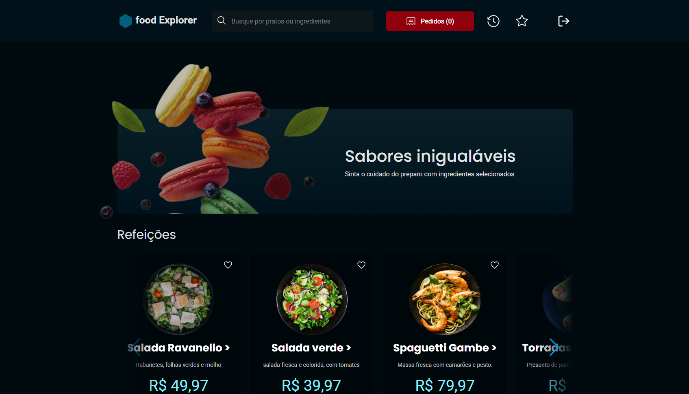

# Front End - Food Explorer

<div align="center">



</div>

## 💻 Sobre

O food explorer é uma aplicação fullstack de um menu interativo para um restaurante fictício desenvolvido durante o curso Explorer da Rocketseat.

## 🎨 Layout

O layout com todas as páginas o foi disponibilizado no figma por meio [DESSE LINK](https://www.figma.com/design/BmlmwETC6AQr8Zbw2cHUod/food-explorer-v2--Community-?node-id=5-980&p=f).

## ⚒️ Tecnologias

As seguintes tecnologias foram empregadas na criação deste projeto:

-   [NodeJS](https://nodejs.org/en)
-   [Express](https://expressjs.com/)
-   [Knex](https://knexjs.org/)
-   [SQLite](https://sqlite.org/index.html)
-   [Multer](https://www.npmjs.com/package/multer)
-   [ReactJS](https://pt-br.react.dev/)
-   [Javascript](https://developer.mozilla.org/pt-BR/docs/Web/JavaScript)
-   [Styled Components](https://styled-components.com/)
-   [JSON Web Token](https://www.npmjs.com/package/jsonwebtoken)
-   [Swiper](https://swiperjs.com/)
-   [Axios](https://www.npmjs.com/package/axios)

---

## 📦 Como utilizar

Clone o projeto para o local desejado em seu computador.

```bash
git clone https://github.com/jakunzler/foodExplorer-frontend
```

### ⚙️ Crie um arquivo de configuração

Crie um arquivo `.env` como mostra no arquivo `.env.example` na raiz do projeto e configure as variáveis de ambiente necessárias. Por exemplo:

```dotenv
AUTH_SECRET=key_jwt
PORT=3333
```

Certifique-se de substituir `key_jwt` pela key configurada no backend.

### 📥 Executando o FrontEnd

```bash
# Navegue até o diretório do FrontEnd
$ cd foodExplorer-frontend

# Instale as dependências necessárias
$ npm install

# Agora inicie o servidor do FrontEnd
$ npm run dev
```

⚠️ **Importante**: Este projeto utiliza uma hospedagem gratuita para o back-end, portanto, pode haver atrasos no tempo de resposta do servidor e informações podem ser perdidas por inatividade no hospedeiro.

## 👩🏾‍💻 Personas

A aplicação foodExplorer possui duas personas principais: o admin e o usuário. É possível criar um novo usuário ou testar a aplicação usando as seguintes informações de login:

Admin:

-   E-mail: <admin@foodexplorer.com>
-   Senha: 123456

O admin tem acesso privilegiado e pode gerenciar o cardápio, adicionando, editando e removendo pratos, alterar os status de pedidos, além de visualizar os pedidos e os usuários cadastrados.

Usuário:

-   E-mail: <customer@foodexplorer.com>
-   Senha: 123456

O usuário tem acesso restrito às funcionalidades da aplicação, podendo visualizar o cardápio, filtrar pratos, ver detalhes de pratos específicos, favoritar pratos e adicionar pratos ao carrinho.

## 📝 Licença

O app Food Explorer é distribuída sob a licença MIT. Isso significa que você pode usar, modificar e distribuir o código desta API livremente, desde que inclua a declaração de direitos autorais e a licença MIT em qualquer cópia ou parte dela.
